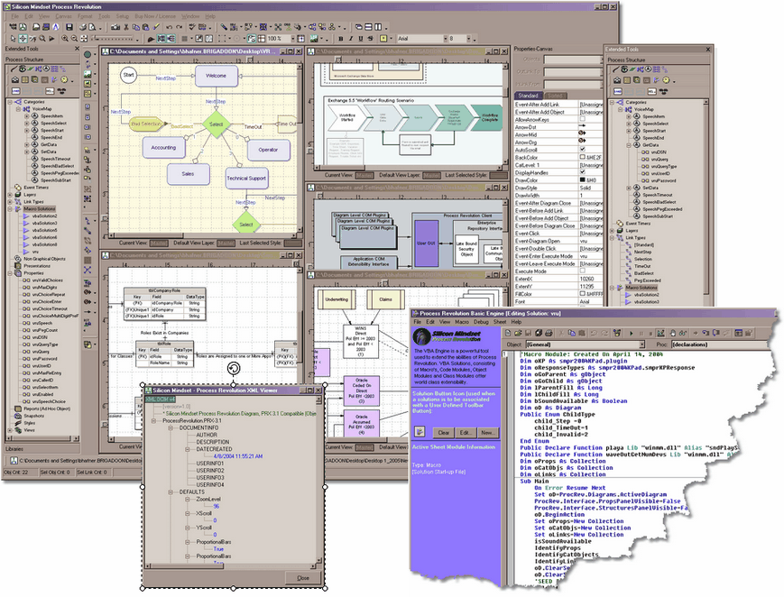

<div align="center">

## Process Revolution 2005\(PE\) \- Fixed


</div>

### Description

Not Your Fathers VISIO<BR>.....Fixed the Download Download<BR>FREE Copy of Full 2004(PE) 'Pro Edition' for Planet Source Code Users. Professional Flow Chart Diagram Tool. Generate PDF / PNG / BMP / JPG / SVG, XML Based, Full VBA Compatible Engine Embedded.
 
### More Info
 


<span>             |<span>
---                |---
**Submitted On**   |
**By**             |[Bruce J\. Hafner](https://github.com/Planet-Source-Code/PSCIndex/blob/master/ByAuthor/bruce-j-hafner.md)
**Level**          |Advanced
**User Rating**    |3.4 (17 globes from 5 users)
**Compatibility**  |VB 6\.0
**Category**       |[Complete Applications](https://github.com/Planet-Source-Code/PSCIndex/blob/master/ByCategory/complete-applications__1-27.md)
**World**          |[Visual Basic](https://github.com/Planet-Source-Code/PSCIndex/blob/master/ByWorld/visual-basic.md)
**Archive File**   |[](https://github.com/Planet-Source-Code/bruce-j-hafner-process-revolution-2005-pe-fixed__1-60042/archive/master.zip)


### Source Code

```
Available from:
http://www.siliconmindset.com
Directly Download from:
http://www.siliconmindset.com/download/smpr2004.exe
Fixed the Downloads (Sorry Guys)... I Deleted the old post to push users to the proper download loacaion. One of the other users will be posting an additional download location if you get no response.
While I will honor Free License requests for others..please limit this to PSC users...Thanks for the Community of PSC over the past 4 years.
This a fully free (With free upgrade to 2005 version when available) of a professional Flow Chart tool that is 5 star rated on many sites. It supports XML file format. Generates PDF, SVG, PNG, BMP, JPG and other formats. It includes a VBA compatible engine with an exposed ActiveX EXE object model to interact with the VBA engine (A requirement to integrate VBA into a product).
I hope you like it. Users at NASA, IKEA, US Airforce and others use it actively. I am still tweaking documentation.
FOr users that want sample VBA code, more advanced diagrams, info on developing plug-ins I will make myself available (as time permits).
Thanks again PSC
-----Old Post Text----
Free License to Planet Source Code requestors
Silicon Mindset's Process Revolution 2004(PE) is a multi purpose business application essential to the optimization of any organization. The application is used to create flow charts, block diagrams, process diagrams, business diagrams, work flow diagrams and more. Diagrams can be stand alone or grouped into a Process Repository. Process Revolution 2004(PE) is perfect for new and advanced business users. This highly cost effective and feature rich application will be used over and over by all levels of users. Process Revolution diagrams can be printed, copied to memory or used to generate advanced web presentations and images (SVG, EMF, WMF, BMP, WBMP, JPG, PNG, TIFF, PCX and others). Whether creating simple organizational charts or creating advanced multi part Process Flow Diagrams users will become instantly familiar and productive. Process Revolution 2004(PE) comes with 10 Diagram/Graph/Chart layout algorithms allowing for rearranging of diagrams and Rotation of entire Diagrams. This feature is not available in any other Flow Charting / Diagramming package in Process Revolutions price range class. Process Revolution 2004(PE) uses XML and compressed XML as its native file formats allowing for OPEN sharing of Diagram information. Process Revolution 2004(PE) is the first application in a series of standalone to enterprise Process Documentation, Modeling and Management applications. Enterprise Versions of Process Revolution will be available in mid 2005 running under windows on the client side and SQL Server Database Management System (with Oracle, Microsoft Access and MySQL to follow based on user demand) on the server side. Process Revolution is a powerful, easy to learn and cost effective application. The Product comes with an extensive help file. A downloadable 145+ page PDF file is available for users wishing to print out a hard copy manual
NOTE: For those that want to do AddIns / Plug-Ins or do Active (VBA) diagrams I will be glad to help with samples andpointers as needed and time permits.
```

